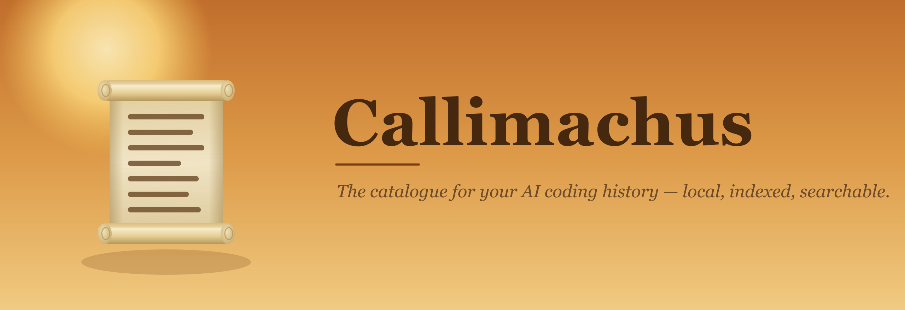

<p align="center">
  
</p>

<p align="center">
  <a href="LICENSE"></a>
  
  
  
  
  
</p>

> **Local index & search for your AI coding-agent threads** — across **11 tools** (Claude Code, Codex, Cursor, Gemini CLI, Qwen Code, Goose, OpenCode, Continue, Cline, Roo Code, Kilo Code) — plus a provider-agnostic chat, an MCP server, a CLI, and a VS Code / Cursor extension. Everything stays on your machine.

Named for [Callimachus](https://en.wikipedia.org/wiki/Callimachus), who built the first catalogue of the Library of Alexandria.

## Download

Grab the latest signed build from **[Releases](../../releases/latest)** — macOS (`.dmg`, Apple Silicon), Windows (`.msi`), or Linux (`.AppImage` / `.deb`). The app auto-updates from there on. Prefer to build it yourself? See [Develop](#develop).

## What it does

- **Indexes** every conversation from 11 coding agents into one local SQLite store — Claude Code, Codex, Cursor, Gemini CLI, Qwen Code, Goose, OpenCode, Continue, Cline, Roo Code, and Kilo Code. Adding another source is a [small, documented contract](apps/desktop/src-tauri/src/indexer/README.md).
- **Searches** them with hybrid ranking: keyword (SQLite FTS5 / BM25) fused with on-device semantic similarity (sqlite-vec KNN, no cloud) via Reciprocal Rank Fusion. Filter by source, project, subagents, starred, and tags.
- **Finds code-aware** — type `file:embed/mod.rs` in the search bar (or `cal files <path>`) to find every thread that touched a path; backed by a file-mention index built at index time.
- **Distills knowledge** — free heuristic TODO extraction, plus opt-in LLM distillation of decisions, gotchas, and summaries, with cross-thread semantic recall of past decisions/gotchas. Optional **auto-distillation** drains new/changed threads in the background so memory self-populates. Needs local Ollama (keyless) or a cloud API key.
- **Curates the facts** — pin, edit, or delete distilled facts so your edits survive re-distilling, plus an LLM **"Review conflicts"** pass that flags decisions that contradict each other.
- **Remembers per project** — a **Projects** tab aggregates each repo's decisions, gotchas, and open TODOs into durable memory (grouped by a canonical project key, so worktrees / symlinks / `~` don't split one repo), with an LLM brief and a managed `.callimachus/memory.md`. That memory is prepended when you "Open in CLI", and you can inject it into any agent automatically: **Update AGENTS.md** (or `cal agents`) writes a managed block into the repo's `AGENTS.md` / `CLAUDE.md`, and `cal hook` feeds it to a Claude Code SessionStart hook.
- **Asks your history (RAG)** — a synthesized, cited answer over your own threads, with `[thread N]` citations back to the sources it used. Needs an LLM engine (Knowledge/distillation enabled).
- **Organizes into collections** — star threads and attach free-form tags, then filter the list by starred or by tag.
- **Chats** with an in-app agent (Anthropic / OpenAI / Gemini / OpenRouter / Ollama — your key, your choice) that can **search your own history** and **run shell commands with your approval**; streaming, cancellable, with live model lists. Chats are saved and become searchable too.
- **Carries context across tools** — open any thread in any agent CLI ("Open in Claude / Codex / Gemini …", seeded with the packed transcript), resume a Claude Code / Codex thread in its native CLI, copy context, or export a thread to Obsidian (optionally AI-summarized with decisions / gotchas / TODOs).
- **Links threads to commits** — infers **on-device** which git commits a thread produced, by overlapping the files a thread discussed with `git log`'s changed files inside the thread's time window (shared-file count = confidence). See it as a thread→commit timeline (`cal commits`), per-thread in the desktop UI ("Produced commits"), or via the `linked_commits` MCP tool.
- **Snapshots agent sessions** — durable, resumable checkpoints of a thread (packed transcript + carry-forward project memory) for handoff across a context-window compaction or across tools; auto-captured via Claude Code PreCompact / SubagentStop hooks. Take, list, and resume them (`cal snapshot` / `cal snapshots` / `cal resume`, or the `snapshot_session` / `list_snapshots` / `load_snapshot` MCP tools).
- **Guards decisions** — decisions can carry a **rationale** ("why"), and an active guard surfaces settled decisions on a topic before an agent re-litigates one (`cal check "<proposal>"` / the `check_decision` MCP tool).
- **Surfaces to your agents** — a bundled MCP server (`callimachus-mcp`) exposes the index as tools any agent can call mid-session, and it's two-way: agents can write back into Callimachus's own memory (close TODOs, record decisions/gotchas, snapshot a session) without ever touching your files. The `/recall` skill teaches them when to use it.
- **Stays current** via a background file watcher; **stays private** — API keys live in the OS keychain, nothing is sent anywhere except the LLM provider you pick.

## Stack

- **Shell:** Tauri 2 (Rust) + React 19 + TypeScript + **Vite 8**
- **Store/search:** bundled SQLite + FTS5 (`rusqlite`); on-device embeddings via `fastembed` (bge-small-en-v1.5, 384-dim); KNN in SQL via `sqlite-vec` (vec0)
- **Watcher:** `notify` + debouncer
- **Chat:** multi-provider via the `genai` crate (Anthropic / OpenAI / Gemini / OpenRouter / Ollama), streaming tokens over a Tauri Channel, cancellable, with agent tool-calls (history search + approved shell)
- **Secrets:** OS credential store via the cross-platform `keyring` crate — macOS Keychain, Windows Credential Manager, Linux Secret Service
- **Sidecars:** `callimachus-mcp` (MCP server) and `cal` (CLI) — both reuse the desktop core lib against the same `index.db`
- **Editor:** a VS Code / Cursor extension (`apps/vscode`, published to the Marketplace + Open VSX) that shells out to `cal`

## Monorepo

This is a [Turborepo](https://turborepo.com) + pnpm workspace.

```
apps/
  desktop/        # the Tauri 2 desktop app + the cal CLI and MCP server (src-tauri)
  vscode/         # VS Code extension (search history from the editor)
  web/            # marketing + download site (reserved, not built yet)
packages/         # shared code, when it appears
.changeset/       # version + changelog management
scripts/          # version-sync, release tagging
```

Releases, versioning, and the auto-updater are documented in [RELEASING.md](RELEASING.md).

## Develop

```bash
pnpm install
pnpm desktop:dev      # launches the desktop window (tauri dev)

# from the repo root, across all apps:
pnpm build            # turbo: build every app's frontend
pnpm typecheck        # turbo: typecheck every app
```

First launch: the index is empty — open **Settings** (or hit **Reindex**) to index your sources, then **Build semantic index** to enable semantic search. **Reindex** runs as a background job with a per-source progress bar, separate from **Build semantic index** — the two are mutually exclusive (one pauses while the other holds the write lock).

### Tests

```bash
cd apps/desktop/src-tauri
cargo test                                   # fast unit tests
cargo test -- --ignored --nocapture          # real-data + model + keychain smoke tests
```

The `--ignored` tests touch live data on this machine: each source has a `real_<source>_index` smoke test that indexes your real history read-only (`~/.claude`, `~/.codex`, Cursor, `~/.gemini`, `~/.qwen`, Goose, OpenCode, Continue, Cline/Roo/Kilo), plus the embedding-model download (first run, needs network) and a Keychain round-trip.

## Use your history anywhere

Beyond the desktop window, the same local index is reachable from your agents, terminal, and editor — all reading one `index.db`.

**MCP server** — let any agent search its own past work mid-session. `callimachus-mcp` ships with the desktop app (on your PATH); just register it with your client:

```bash
claude mcp add callimachus -- callimachus-mcp        # or any MCP client
```

Building from a checkout instead? `cargo install --path apps/desktop/src-tauri --bin callimachus-mcp`.

Tools (21) — now read **and** write. Reads (17): `search_threads`, `search_current_project` (auto-scoped to the repo it runs in), `recent_threads`, `get_thread`, `list_tags`, `list_open_todos`, `get_thread_knowledge`, `recall_decisions`, `recall_gotchas`, `find_prior_work` (the "have I done this before?" guard — prior sessions similar to a task), `project_memory` (a project's aggregated decisions / gotchas / open TODOs), `ask_history` (a cited RAG answer over your history), `threads_for_file` (which sessions touched a path), `check_decision` (surface settled decisions before re-litigating a proposal), `linked_commits` (the commits a thread likely produced), `list_snapshots` (a project's session snapshots), and `load_snapshot` (restore a saved checkpoint). Writes (4, into Callimachus's own memory, never your code): `complete_todo` (close an open TODO), `record_decision` (optionally with a `rationale`), `record_gotcha` (persist a fact into a project's memory), and `snapshot_session` (checkpoint a thread for handoff). The bundled `/recall` skill ([.claude/skills/recall](.claude/skills/recall/SKILL.md)) tells agents when to reach for them.

**CLI** — `cal`, pipe-friendly. Ships with the desktop app (on your PATH); or build from a checkout with `cargo install --path apps/desktop/src-tauri --bin cal`.

```bash
cal search "vector index migration" -y    # -y = hybrid (semantic + keyword)
cal recent -n 10
cal cat 42 | pbcopy                        # packed transcript → clipboard
cal stats                                  # index totals + per-source breakdown
cal export 42 --vault ~/Obsidian           # write a thread as an Obsidian note
cal ask "how did we set up releases?"      # cited RAG answer over your history
cal files embed/mod.rs                     # threads that touched a file path
cal memory                                 # this repo's distilled memory (decisions/gotchas/TODOs)
cal done 17                                # mark an open TODO done (id from `cal todos`)
cal remember decision "use sqlite-vec for KNN" --because "no cloud, KNN in SQL"  # record a fact (+ rationale) into the repo's memory
cal check "switch to pgvector"             # surface settled decisions before re-litigating one
cal commits                                # infer the thread→commit timeline for this repo (--json; or pass a path)
cal snapshot 42 -l "pre-refactor"          # checkpoint a thread for handoff (transcript + project memory)
cal snapshots                              # list saved session snapshots (optionally for a project)
cal resume 7 -a claude                     # resume a snapshot in an agent CLI
cal agents                                 # write the repo's memory into AGENTS.md (any agent reads it)
cal hook                                   # print the repo's memory (use as a Claude Code SessionStart hook)
```

`star`, `tag`, `tags`, `todos`, `knowledge`, `distill`, `decisions`, `gotchas`, and `related` also exist — run `cal help` for all 21.

**VS Code / Cursor** — the extension adds a "Callimachus History" sidebar, a status-bar search button, and commands to search / insert / copy threads (it shells out to `cal`). Install from the **[VS Code Marketplace](https://marketplace.visualstudio.com/)** or **[Open VSX](https://open-vsx.org/)** (the registry **Cursor** and VSCodium use), or grab the `.vsix` from [Releases](../../releases). See [apps/vscode/README.md](apps/vscode/README.md).

## Notes / limitations

- Cross-platform (macOS / Windows / Linux). The only macOS-only piece left is the "Open in CLI" / "Resume" launchers (they drive Terminal via AppleScript); on Windows/Linux those actions return a "not supported yet" notice — everything else (index, search, chat, export, keychain) works everywhere.
- Cline / Roo Code / Kilo Code are editor extensions with no CLI, so they are index-only (searchable, but not relaunchable via "Resume").
- Cursor doesn't store a per-thread workspace, so Cursor threads currently have no project path.
- Claude Code subagent transcripts are indexed but hidden behind a "subagents" toggle by default.
- Large first index is a one-time cost (the Claude corpus here was ~90k messages in ~25s); subsequent passes skip unchanged files.
- More sources (Charm Crush, Factory Droid, Copilot CLI) are scoped but not yet integrated — see [the indexer guide](apps/desktop/src-tauri/src/indexer/README.md).

## Contributing

Issues and PRs welcome. [CONTRIBUTING.md](CONTRIBUTING.md) covers local setup, conventions, and the release flow. Adding support for another agent is a [small, documented contract](apps/desktop/src-tauri/src/indexer/README.md) — usually one indexer module + a migration + a few wiring points.

## Security & privacy

Callimachus is local-first by design: your conversation index never leaves your machine, API keys live in the OS keychain (never on disk), and the only outbound traffic is to the LLM provider you explicitly choose. To report a vulnerability, see [SECURITY.md](SECURITY.md).

## License

**Dual-licensed.** Free and open source under **[AGPL-3.0-or-later](LICENSE)** — use,
modify, and share it; if you distribute it or run a modified version as a network
service, you must release your source under the AGPL.

For **closed-source, proprietary, or for-profit/SaaS use** that the AGPL doesn't
permit, a **commercial license** is required — see **[COMMERCIAL.md](COMMERCIAL.md)**
(contact ari@shaller.dev).

© 2026 Ari Shaller. See [NOTICE](NOTICE) for attributions. Contributions are accepted
under the terms in [CONTRIBUTING.md](CONTRIBUTING.md).

## Acknowledgements

Built on [Tauri](https://tauri.app), [fastembed-rs](https://github.com/Anush008/fastembed-rs), [sqlite-vec](https://github.com/asg017/sqlite-vec), and [genai](https://github.com/jeremychone/rust-genai). Named for [Callimachus of Cyrene](https://en.wikipedia.org/wiki/Callimachus), who catalogued the Library of Alexandria.

<p align="center"><sub>Social preview: <a href="assets/og.png"><code>assets/og.png</code></a> · brand sources in <a href="assets/brand"><code>assets/brand/</code></a></sub></p>
